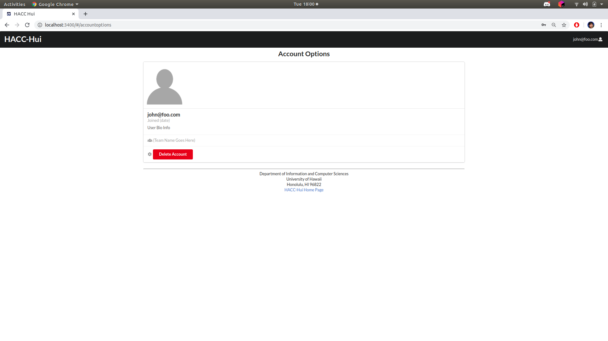
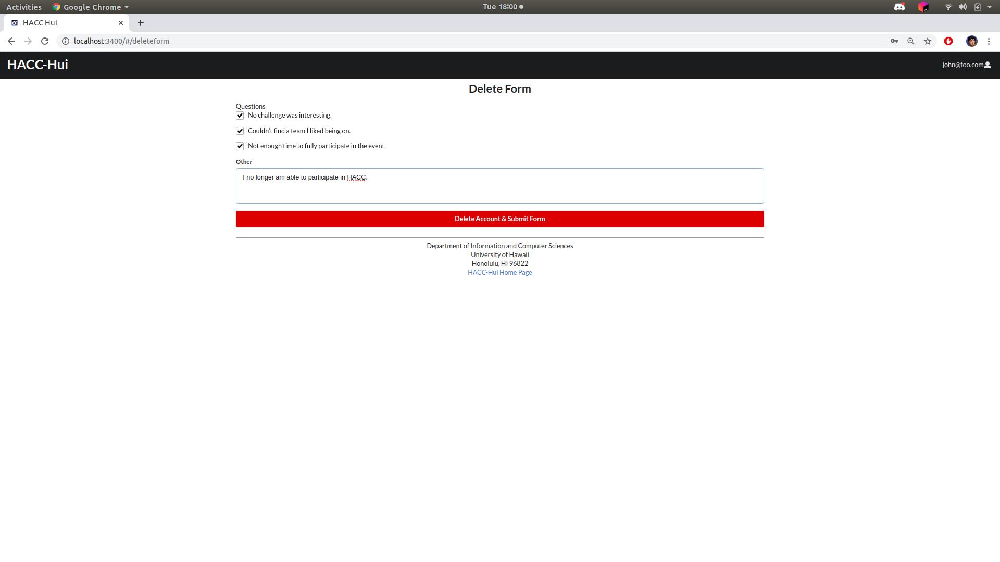
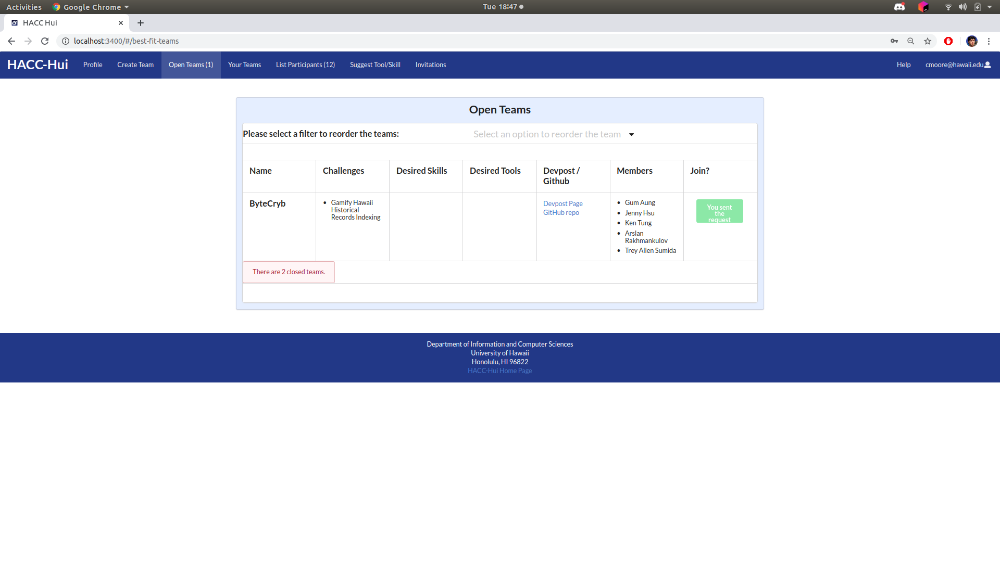
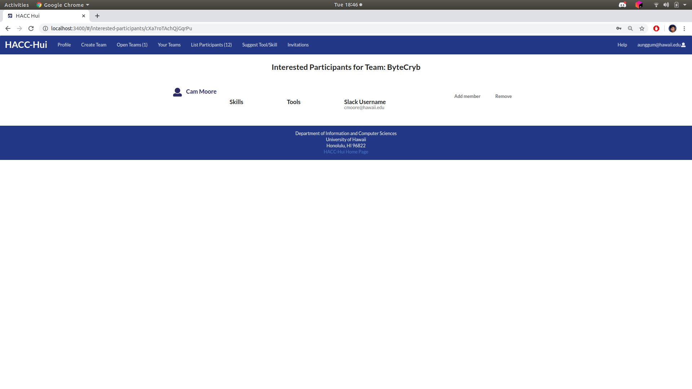
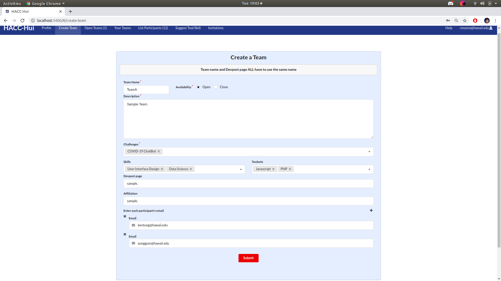
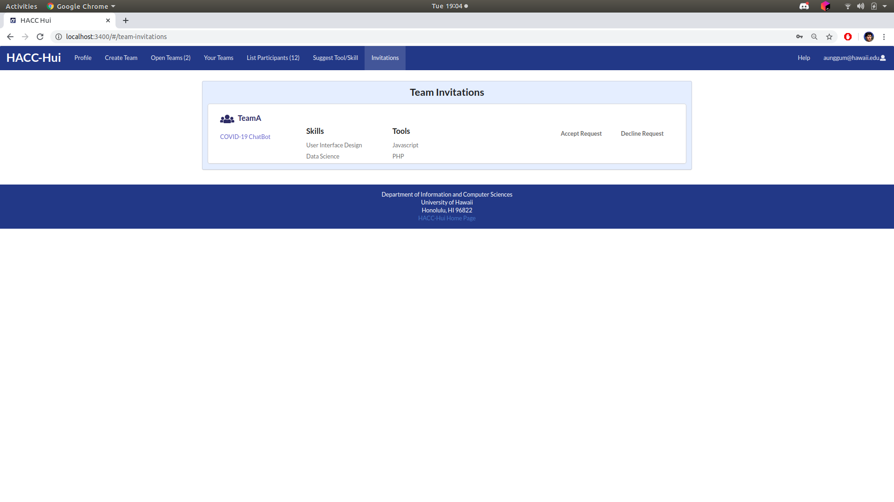
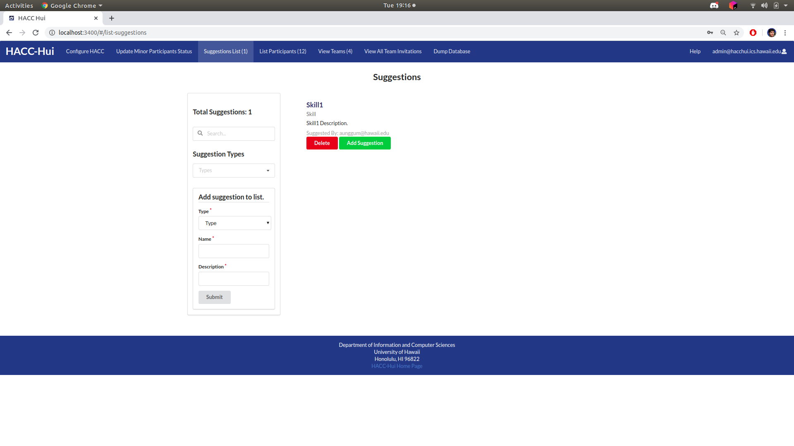

Nathan Zenger
 
HACC-Hui is a web application that was developed for the HACC (Hawaii Annual Code Challenge) event for participants to use for registration and organization. The main purpose of this web app is to allow people to register for the event, search and join different HACC teams, and connect and communicate with everyone involved in the event. This was developed by the ICS414 class this Fall 2020 Semester in a group effort of the entire class where we broke into separate teams of 4-5 people and worked on different portions of the website throughout a development period of about 2 months. (https://github.com/HACC-Hui/HACC-Hui). 

Each development period for the application was broken into milestones objectives which contained multiple tasks needed to be completed and presented by a certain date. I will go over what role I played in each milestone and what features I implemented. Milestone 1, in this first milestone for the project we started with a basic react meteor template that had been modified to incorporate slackbot and HACC-Hui related collections such as developers, teams, profiles and more. My job for this milestone was to create a delete account functionality, where a user would be able to delete their own account in the scenario where they drop out of the HACC for some reason. The way I went about implementing this was to delete account options on the users profile page that would access the developer collection containing that user's account and then remove them from it via deleting the object in the collection.

Once choose the delete option, it will prompt the user to answer a questionnaire before the deletion is complete. 

After the user completes and submits a modal will appear notifying the user their account was deleted and they will be signed out successfully. 
Onto Milestone 2 my task for this development period was to allow a participant to indicate that they would like to join a team. The way I did this task was putting a “Interested in joining” button next to teams listed on the teams page and when clicked slackbot will DM the team owner letting them know of the participants desire to join. I also created a page called “Interested Participants” in which the current members of a team could see a list of all the participants interested in joining their team. Here is the teams page where the user can select the interested button and request to join the team.
 
Then I logged into an account that was a member of that team that this account requested to join and as you can see that user is populated into the Interested Participants page on their account showing that the task was implemented successfully.
 
Next was milestone 3 and the development process switched from teams within the class to the whole class working together as one team sharing tasks. So for this task I needed to allow participants to send out invites to listed members upon creating a team. So if you make a team you can list other developers you want to join and HACC-Hui will send out invites to ones that have registered with slackbot. To implement this I added a list function on create teams where strings of usernames could be added to a list and upon submitting team creation the user would receive a slackbot notification and the team invite would show up inside of the Invitations tab which was done by adding the team info to the users invitations collection. Here is what the create team page looks like with the user invite function at the bottom.

And here is what the invited users invitation will look like.

There was a bug during the development of this feature where the team names on invitations would be duplicates of each other and never change. We found out this was due to certain objects not being wiped upon every add and once we changed it the bug was fixed. For the last milestone 4 I picked up a task where the admins needed to be able to add their own suggestion on the suggestion tab. Normal users could submit this but there was no way for other admins to add suggestions for each other. So to create this functionality for admins I replicated code that was used for users adding suggestions and refactored it to work with the admin page so they could do the same. The resulting page looked like this. 

I chose to put the add system on the side so that the list of user suggestions could be displayed in the center. So with this added Admins can now view and add suggestions. That concludes all of the work I did over the course of the semester for HACC-Hui.

To go over the team experience I was in a team with 3 other classmates(Kyle Okamoto, Ty Uehara, and WeiMai)  called CodeMonkeys5. I only worked in this team up until milestone 3 where we switched to the whole class being one team. The team experience overall was positive and I think I learned a lot about what components are required in a team in order for it to function properly. Our process for assigning tasks was pretty much first come first serve, I would post the task descriptions as issues up on our team and then we would all just pick whichever ones interested us. If there was a situation where there were more tasks in a milestone then team members, then we just resorted to the first person done with their task and would pick up the next one. 
We would help each other out with task issues here and there via discord and would usually meet a day or two before milestone deadlines to show off what we completed and discuss presentation plans for the next day of class. I would usually coordinate these meetings and try to help everyone get our code on the same master branch. In hindsight we should have had some git regulations and practices that we all abided by so that our code merging would go a bit smoother. A lot of the time we had a very difficult time merging and getting all of our code working together properly, this was probably due to lack of communication and not presenting code earlier to each other. 
At one point we couldn't make a merge happen without breaking the project so we had to present all of our tasks in separate branches. Our team was still functional though and we all met our deadlines at the end of the day even though it could’ve been a bit better. I think assigning roles to each team member with responsibilities outside of just doing tasks would have been very helpful, so we would have someone checking and managing code progress, creating issues for the team, and coordinating meetings. With roles like these we would've been way more organized then we were. 

My personal experience throughout the ICS414 course this semester was challenging and required a lot of adaptation out of me. At first it was a bit difficult for me to understand the overall scope of the web app we were making and what exactly it was supposed to do and look like. Also the fact that we had to develop this web app within 2 months was a bit stressful but I adapted to the pace after the first milestone where the development flow of the project was a bit more clear. Many of the milestone objectives were very ambiguous or not well explained for the course, but our teacher understood that it was the first time this type of course was being taught and accommodated as much as possible, which was a major positive that helped out over the semester. Something I wish we did was a bit of react and meteor refreshment assignments before we dug into developing the web app as for many of us we hadn’t done ICS314 in a year plus which made it hard to jump right back into being proficient with those frameworks. Another thing I wish we did from the start was have the whole class on one team because when all the separate teams would create the same functionalities and one teams implementation while the rest were discarded just felt like a waste of time and resources when we had a deadline. I’m fine with sub-teams in the class just wish each team works on different tasks instead of duplicates. Overall I thought the class was positive as we were all figuring things out together and taught me things to do and not to do when developing a web app in a large group. 
