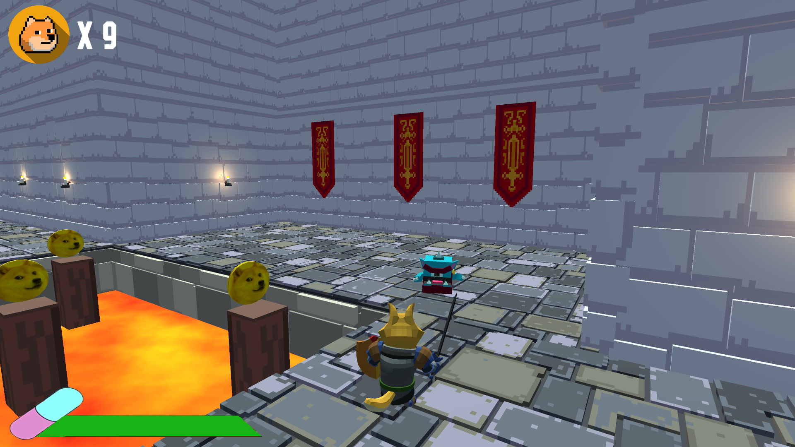
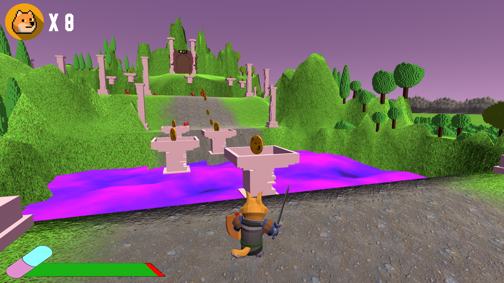

Doge Quest is a game demo developed in Unity using C++ scripting and Bolt visual scripting together to create enemy AI, player mechanics, and level mechanics. In the game you play as a Shiba Knight on his quest to travel the lands and collect as much "Doge Coin" as possible using his sword and platforming abilities. Had previous knoledges of Unity and C++ scripting prior to this project but learned how to use the visual scripting language Bolt, which was a very useful tool for making Finite State machines that were used to create the enemies AI.

http://textxchange.meteorapp.com/

