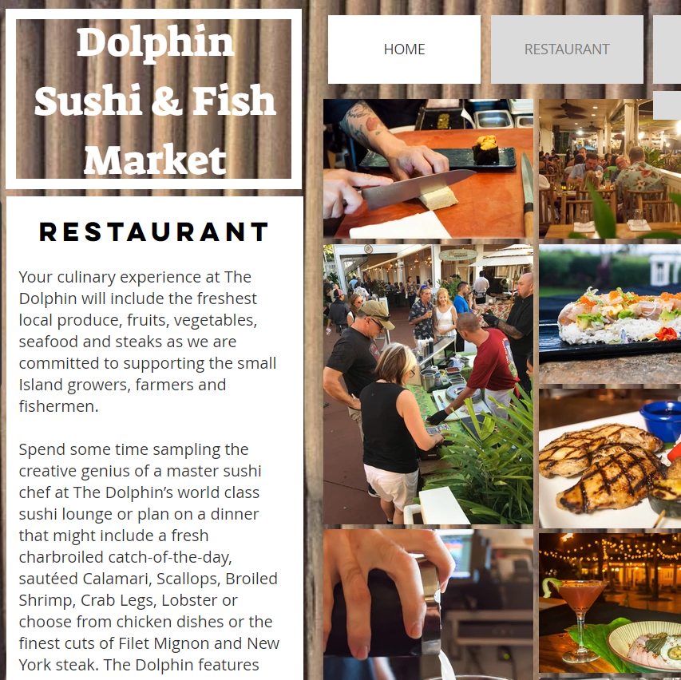

This project is a website I developed for a restaurant I was employed at over the summer. The website is a basic general overview of informations and services of the buisness and conveys easily accesible info for inquiring customers to view. I used Wix and it's editor to create the website at the request of my Boss at the time and although it is not developing a website from scratch with a computer language I still learned a lot about web design from this solo endevour. It is a harder task then I thought to visually present information to a user in a organized and logical way that is also aesthetically pleasing. But through trial and error and research I developed a template that I think conveys the info well and at the end of the project became fluent with the editor. I am still making adjustments and changes on the side for my client so it is a work in progress.

link to current version of the website: https://nzenger.wixsite.com/dolphin/restaurant
