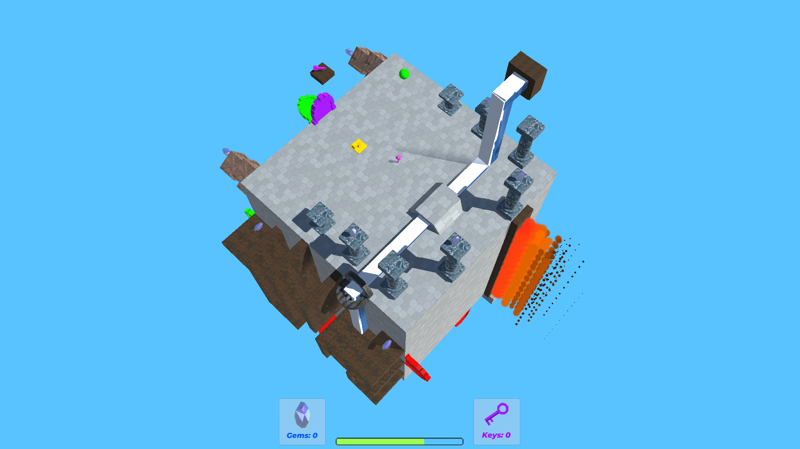

  
  
  

Kubus is a geometry puzzle game centered around navigating your way around a cube by switching gravity and rotating the faces of each side. To solve the levels you must rotate sides, find hidden items, and open doors to reach the center of each cube. We are a team consisiting of 2 programmers and 1 artist working with Unity, Blender, and Maya to create innovative levels and satisfying puzzles. The game is currently in development and being updated on a weekly basis with visual and mechanic improvments.

[Playtest Here](https://digitaloasis.itch.io/kubus)
