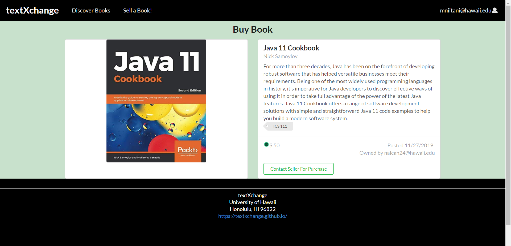

A web application that I developed with a team of 3 other UH Manoa students for ICS 314 which utilizes Meteor and React. This Web applications purpose is to be a market place where students can make accounts and sell their used textbooks online to other students on campus to save money on buuying textbooks for classes and sellers can make money back for textbooks they already have in their possesion. I was a co-developer on the team and implemented features such as the sign in and register pages while also setting up email notifications for purchasing books and registering on the website. Other minor features I added to the website was the option to delete books and building the profile page. As a team we utilized Github desktop to assign issues and organize our work on this larger scale project.

link to current version of the website: http://textxchange.meteorapp.com/
link to Github page of web application: https://textxchange.github.io/
