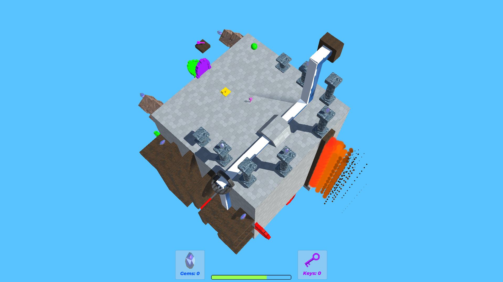
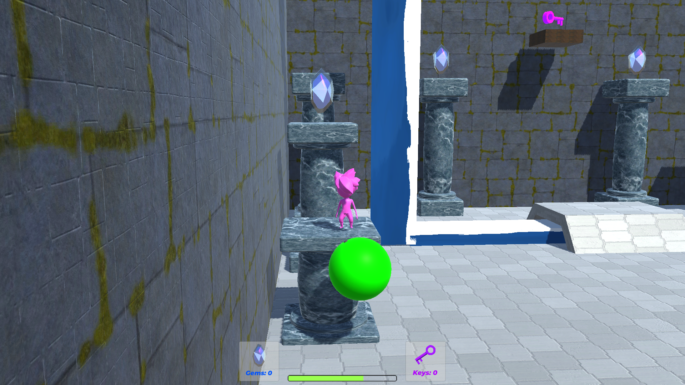

  
  

First global game jam project made in the course of 72 hours with a team consisting of 2 programmers and 1 artist.
The game is a 2D sprite platformer where you play as "Beepers" a malfunctioning medical droid that needs to heal patients by searching for and gathering thier required organs throughout the level.
I was a programmer for the game and created the attacks and movements of the character along with the inventory system, gaining Unity 2D game experience and how to deliver a product under a tight deadline.

[Playtest Here](https://globalgamejam.org/2020/games/human-repair-9)
