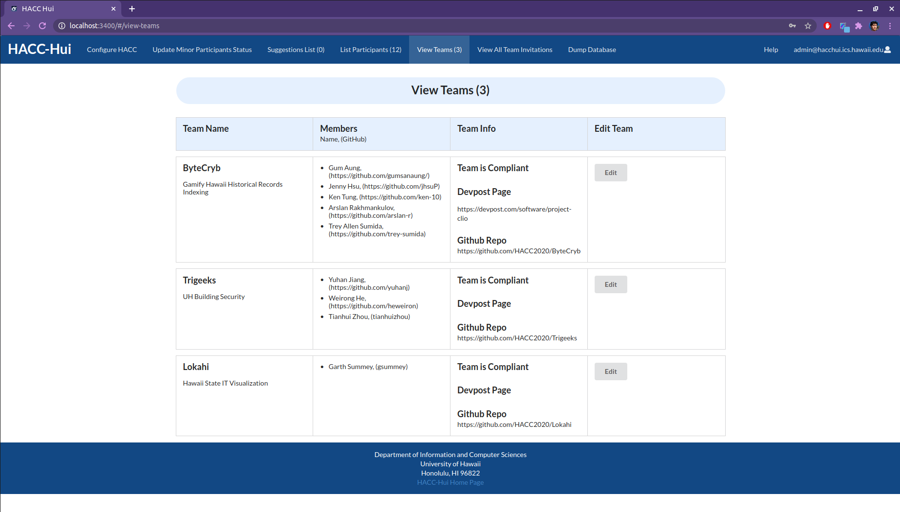
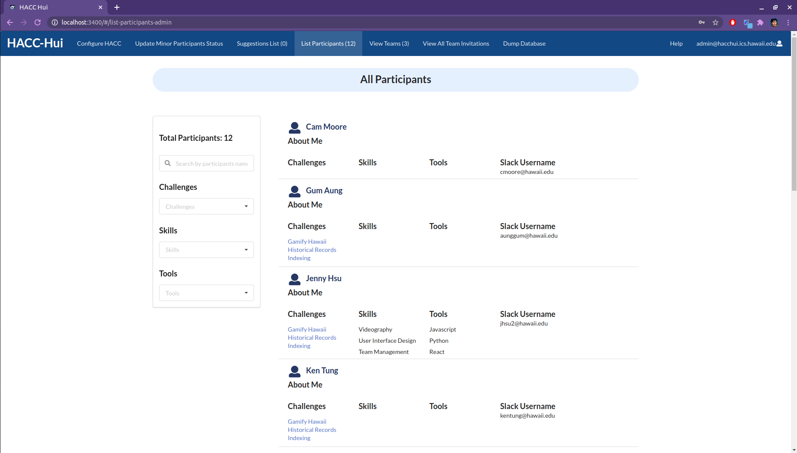
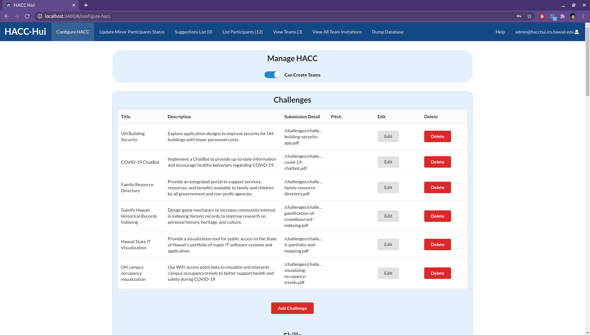

  
  
   

HACC-Hui is a web application that was developed for the HACC(Hawaii Anual Code Challenge) hackathon event in Fall of 2020. The purpose of the web app was to allow participants of the event to find, create, and manage teams that they are in to streamline the teaming up process of the event. This web app utilized the Slack API by making an slack bot that would register the users on the site and allow them to send invites and requests to each other through slack. The whole class of ICS 414 collaborated on the development of the web application by working on different features and functionalities. My contributions to this project was creating the teams page, admin features such as the suggestions page, and bug hunting and refactoring. This project provided me with the experience of working on a large development team and full stack developing a web app over the course of 2 months.

[Github Page](https://github.com/HACC-Hui/HACC-Hui)  
[Overview Page](https://hacc-hui.github.io/)
